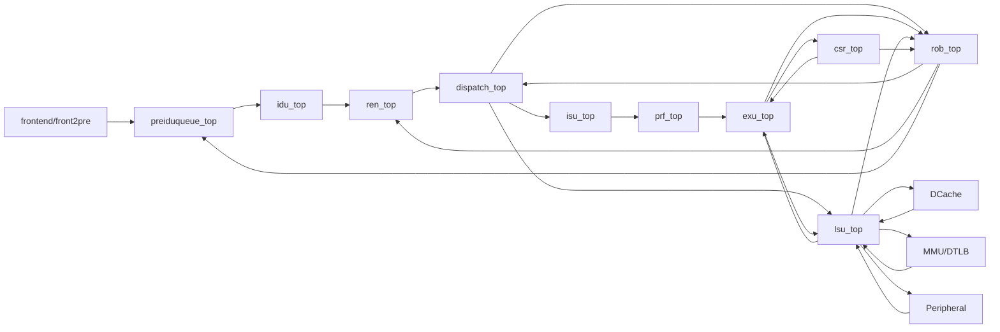

# 后端 Top 连接关系说明

## 1. 交付范围

本文档说明 `back_end/` 当前版本的后端顶层连接关系。当前交付内容只表达模块之间的输入、输出和顶层对外端口来源，不展开各模块内部寄存器、RAM、队列、切刀逻辑和具体功能实现。

当前版本遵循以下规则：

| 规则 | 说明 |
|---|---|
| 顶层端口拆开 | `back_top.v` 不再使用总包 `Back_in/Back_out`，而是把需要对外连接的字段拆成独立端口，便于后续和前端、DCache、外设、MMU/DTLB 对接。 |
| 只保留 10 个后端模块 | 当前只维护 `preiduqueue`、`idu`、`ren`、`dispatch`、`isu`、`prf`、`exu`、`rob`、`csr`、`lsu`。 |
| 不自行新增无依据端口 | 顶层端口来自 C++ 已有结构字段或已有模块接口；如果后续必须新增端口，需要单独说明来源和用途。 |
| BSD 例化下放到模块内 | `back_top.v` 只做模块间连线；各模块自己的 `xxx_top.v` 内部再例化 `xxx_bsd_top`。 |
| BSD 接口统一 | 各 `xxx_bsd_top` 对外接口统一使用 `pi/po`。 |

## 2. 目录结构

```text
back_end/
|-- back_top.v
|-- preiduqueue/
|   |-- preiduqueue_top.v
|   `-- slices/
|-- idu/
|   |-- idu_top.v
|   `-- slices/
|-- ren/
|   |-- ren_top.v
|   `-- slices/
|-- dispatch/
|   |-- dispatch_top.v
|   `-- slices/
|-- isu/
|   |-- isu_top.v
|   `-- slices/
|-- prf/
|   |-- prf_top.v
|   `-- slices/
|-- exu/
|   |-- exu_top.v
|   `-- slices/
|-- rob/
|   |-- rob_top.v
|   `-- slices/
|-- csr/
|   |-- csr_top.v
|   `-- slices/
|-- lsu/
|   |-- lsu_top.v
|   `-- slices/
|-- 后端Top连接关系说明.md
`-- 后端Back_out未具体实现端口检查.md
```

## 3. 顶层数据流总览



## 4. back_top.v 顶层接口

`back_top.v` 当前对外接口如下：

```verilog
module back_top (
    input  wire [W_FrontPreIO-1:0]       front2pre,
    input  wire [W_PeripheralRespIO-1:0] peripheral_resp,
    input  wire [W_DcacheLsuIO-1:0]      dcache2lsu,
    input  wire [W_MMULsuIO-1:0]         mmu2lsu_io,

    output wire                                          mispred,
    output wire                                          stall,
    output wire                                          flush,
    output wire                                          fence_i,
    output wire                                          itlb_flush,
    output wire [FETCH_WIDTH-1:0]                        fire,
    output wire [31:0]                                   redirect_pc,
    output wire [(W_BackCommitEntry * COMMIT_WIDTH)-1:0] commit_entry,
    output wire [31:0]                                   sstatus,
    output wire [31:0]                                   mstatus,
    output wire [31:0]                                   satp,
    output wire [1:0]                                    privilege,
    output wire [W_PeripheralReqIO-1:0]                  peripheral_req,
    output wire [W_LsuDcacheIO-1:0]                      lsu2dcache,
    output wire [W_LsuMMUIO-1:0]                         lsu2mmu_io
);
```

顶层端口来源如下：

| 顶层端口 | 方向 | 来源依据 | 当前连接 |
|---|---|---|---|
| `front2pre` | input | `Back_in` 继承的 `FrontPreIO` | 输入 `preiduqueue_top`；其中 `front_stall` 同时拆出后连接 ROB。 |
| `peripheral_resp` | input | `Back_in.peripheral_resp` | 输入 `lsu_top`。 |
| `dcache2lsu` | input | `Back_in.dcache2lsu` | 输入 `lsu_top`。 |
| `mmu2lsu_io` | input | `lsu->in.mmu2lsu` | 输入 `lsu_top`，不置 0。 |
| `mispred` | output | `Back_out.mispred` | 正常来自 `idu_top`，flush 时由 `rob_top` 路径置 1。 |
| `stall` | output | `Back_out.stall` | 来自 `preiduqueue_top` 的 `pre2front.ready` 反相。 |
| `flush` | output | `Back_out.flush` | 来自 `rob_top` 的 broadcast。 |
| `fence_i` | output | `Back_out.fence_i` | 来自 `rob_top` 的 broadcast。 |
| `itlb_flush` | output | `Back_out.itlb_flush` | 来自 `rob_top` broadcast 中的 fence 字段。 |
| `fire` | output | `Back_out.fire` | 来自 `preiduqueue_top`。 |
| `redirect_pc` | output | `Back_out.redirect_pc` | 非 flush 来自 `idu_top`；flush 时由 `csr_top/rob_top` 路径选择。 |
| `commit_entry` | output | `Back_out.commit_entry` | 由 `rob_top` 输出的 `rob_commit` 在 `back_top.v` 中组合打包生成。 |
| `sstatus/mstatus/satp/privilege` | output | `Back_out` 中 CSR 状态字段 | 来自 `csr_top`。 |
| `peripheral_req` | output | `lsu->out.peripheral_req` | 由 `lsu_top` 直接输出。 |
| `lsu2dcache` | output | `lsu->out.lsu2dcache` | 由 `lsu_top` 直接输出。 |
| `lsu2mmu_io` | output | `lsu->out.lsu2mmu` | 由 `lsu_top` 直接输出。 |

## 5. 模块间一级连线

总顶层只连接各模块一级接口，不展开模块内部结构。

| 来源模块/外部 | 信号 | 去向模块/外部 |
|---|---|---|
| 外部 | `front2pre` | `preiduqueue_top` |
| `preiduqueue_top` | `pre_issue` | `idu_top` |
| `idu_top` | `idu_consume`、`idu_br_latch` | `preiduqueue_top` |
| `idu_top` | `dec2ren` | `ren_top` |
| `idu_top` | `dec_bcast` | `ren_top/dispatch_top/isu_top/prf_top/exu_top/rob_top/lsu_top` |
| `ren_top` | `ren2dec` | `idu_top` |
| `ren_top` | `ren2dis` | `dispatch_top` |
| `dispatch_top` | `dis2ren` | `ren_top` |
| `dispatch_top` | `dis2iss` | `isu_top` |
| `dispatch_top` | `dis2rob` | `rob_top` |
| `dispatch_top` | `dis2lsu` | `lsu_top` |
| `isu_top` | `iss2dis` | `dispatch_top` |
| `isu_top` | `iss2prf` | `prf_top` |
| `isu_top` | `iss_awake` | `dispatch_top` |
| `prf_top` | `prf2exe` | `exu_top` |
| `prf_top` | `prf_awake` | `dispatch_top/isu_top` |
| `prf_top` | `ftq_prf_pc_req` | `preiduqueue_top` |
| `preiduqueue_top` | `ftq_prf_pc_resp` | `prf_top` |
| `exu_top` | `exe2prf` | `prf_top` |
| `exu_top` | `exe2iss` | `isu_top` |
| `exu_top` | `exe2csr` | `csr_top` |
| `exu_top` | `exe2lsu` | `lsu_top` |
| `exu_top` | `exu2id` | `idu_top` |
| `exu_top` | `exu2rob` | `rob_top` |
| `rob_top` | `rob_bcast` | `preiduqueue_top/ren_top/dispatch_top/isu_top/prf_top/exu_top/csr_top/lsu_top` |
| `rob_top` | `rob_commit` | `preiduqueue_top/ren_top/lsu_top/back_top.v` |
| `rob_top` | `rob2dis` | `dispatch_top` |
| `rob_top` | `rob2csr` | `csr_top` |
| `csr_top` | `csr2exe` | `exu_top` |
| `csr_top` | `csr2rob` | `rob_top` |
| `csr_top` | `csr2front` | `back_top.v` 生成 `redirect_pc` 时使用 |
| `csr_top` | `csr_status` | `exu_top/lsu_top/back_top.v` |
| 外部 | `peripheral_resp`、`dcache2lsu`、`mmu2lsu_io` | `lsu_top` |
| `lsu_top` | `lsu2exe` | `exu_top` |
| `lsu_top` | `lsu2dis` | `dispatch_top` |
| `lsu_top` | `lsu2rob` | `rob_top` |
| `lsu_top` | `peripheral_req`、`lsu2dcache`、`lsu2mmu_io` | 外部 |

## 6. 顶层输出组合关系

| 输出 | 组合关系 | 说明 |
|---|---|---|
| `fire` | `preiduqueue_out_pre2front_fire` | PreIduQueue 返回给前端的消费信息。 |
| `stall` | `~preiduqueue_out_pre2front_ready` | 对齐 C++ 中 `out.stall = !pre2front.ready`。 |
| `flush` | `rob_out_rob_bcast_flush` | ROB broadcast 直接引出。 |
| `fence_i` | `rob_out_rob_bcast_fence_i` | ROB broadcast 直接引出。 |
| `itlb_flush` | `rob_out_rob_bcast_fence` | 当前按 C++ 路径由 ROB broadcast 的 fence 字段引出。 |
| `mispred` | flush 时为 `1'b1`，否则为 `idu_out_dec_bcast_mispred` | 对齐 C++ flush 场景下的恢复行为。 |
| `redirect_pc` | 非 flush 取 IDU；flush 时在 CSR epc、CSR trap_pc、ROB pc+4 中选择 | `back_top.v` 中拆成 `redirect_pc_from_flush`，便于阅读。 |
| `sstatus/mstatus/satp/privilege` | `csr_status` 拆字段 | CSR 状态输出。 |
| `peripheral_req/lsu2dcache/lsu2mmu_io` | `lsu_top` 直接输出 | 不再置空或置 0。 |

## 7. commit_entry 处理说明

`commit_entry` 由 `rob_commit` 组合打包生成。当前对外提交版不包含 `tma/dbg` 两类性能/调试侧带字段；`rob_commit` 内部原始宽度仍保留这些字段，用于和已有模块接口对齐。

| `commit_entry` 字段类型 | 当前来源 |
|---|---|
| `valid` | 来自 `rob_commit_entry_valid`。 |
| `diag_val` | 正常来自 `rob_commit`；flush 且该 lane valid 时替换为 `redirect_pc`。 |
| `dest_areg/dest_preg/old_dest_preg` | 来自 `rob_commit`。 |
| `ftq_idx/ftq_offset/ftq_is_last` | 来自 `rob_commit`。 |
| `mispred/br_taken/dest_en/func7` | 来自 `rob_commit`。 |
| `rob_idx/stq_idx/stq_flag/rob_flag` | 来自 `rob_commit`。 |
| `page_fault_inst/page_fault_load/page_fault_store/illegal_inst` | 来自 `rob_commit`。 |
| `flush_pipe/type` | 来自 `rob_commit`。 |
| `src_areg/src_preg/src_en/src_busy/src_is_pc/src_is_imm` | `RobCommitInst` 当前没有来源，按 C++ `to_inst_entry` 默认清零行为填 0。 |
| `func3/imm/br_id/br_mask/csr_idx/ldq_idx/expect_mask/cplt_mask/is_atomic` | `RobCommitInst` 当前没有来源，按 C++ `to_inst_entry` 默认清零行为填 0。 |
| `tma/dbg` | 对外提交版已删除，不进入 `commit_entry`。 |

## 8. 单模块 wrapper 规则

每个模块目录下的 `xxx_top.v` 采用统一结构：

| 内容 | 说明 |
|---|---|
| 对外接口 | 暴露该模块已有的一级输入输出接口。 |
| 内部处理 | 在本模块文件中完成必要字段切分和 `pi/po` 打包。 |
| BSD 例化 | 在本模块文件中例化 `xxx_bsd_top`，不放在 `back_top.v` 中。 |
| 内部结构 | 寄存器、RAM、队列、切刀逻辑不作为模块对外端口。 |

示例结构：

```verilog
wire [W_XxxIn-1:0]  pi;
wire [W_XxxOut-1:0] po;

assign pi = {input_a, input_b};
assign {output_a} = po;

xxx_bsd_top u_xxx_bsd_top (
    .pi(pi),
    .po(po)
);
```

## 9. 当前未纳入内容

| 内容 | 当前处理 |
|---|---|
| 独立 MMU 模块 | 暂不新建，只保留 LSU 已有的 `mmu2lsu_io/lsu2mmu_io` 端口。 |
| `restore_from_ref/restore_checkpoint` | 按当前反馈不进入 RTL top，不添加 `restore_valid/restore_pc`。 |
| 模块内部寄存器/RAM 接口 | 不作为顶层或模块 wrapper 的对外端口。 |

## 10. 格式要求

所有 `.v` 文件中不使用以下模板语句：

```verilog
`ifndef ...
`define ...
`endif
`default_nettype none
`default_nettype wire
```
