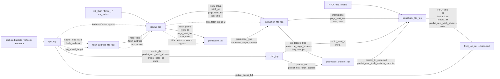
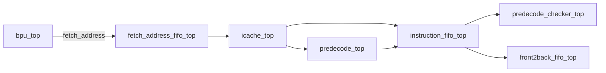
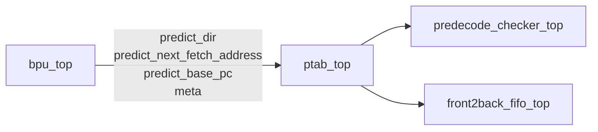
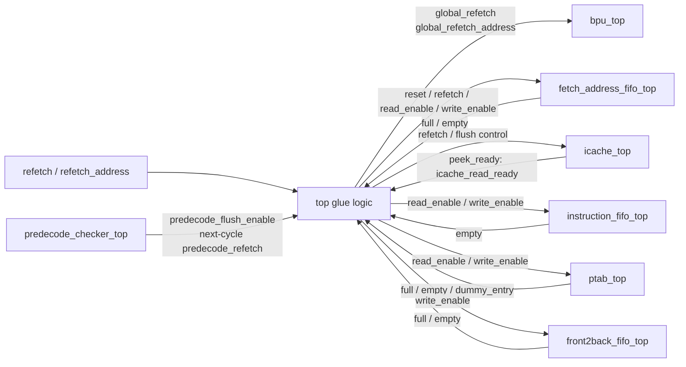

# 前端 Top 模块连接示意图

## 1. 说明范围

本文档只画 `front_top.v` 中 **一级 top wrapper 模块之间** 的连接关系，不展开各模块内部 `bsd_top / slices` 的实现细节。

当前示意图按全分支训练口径绘制：真实 BPU 路径和 ICache slot0 是主线；Oracle、2-Ahead/NLP、ICache slot1、fetch-to-ICache bypass 和 ICache-to-predecode bypass 需要在 HTML 与 `.v` 中保留展开依据。Oracle 是模拟器参考分支，不作为可综合硬件数据源。

当前前端一级模块共 8 个：

1. `bpu_top`
2. `fetch_address_fifo_top`
3. `icache_top`
4. `predecode_top`
5. `instruction_fifo_top`
6. `ptab_top`
7. `predecode_checker_top`
8. `front2back_fifo_top`

主要依据文件：

- `top/front_end/front_top.v`
- `simulator-new/front-end/front_IO.h`
- `simulator-new/front-end/front_top.cpp`

---

## 2. 前端 top 总体示意图

---

## 3. 两条主路径

### 3.1 指令路径

这条路径负责把：

- 取指地址
- 取回来的指令组
- PC
- 页故障位
- 有效位
- 预解码结果

一路送到后级。

### 3.2 预测路径

这条路径负责把：

- 预测方向
- 预测下一取指地址
- 每 lane 的 `predict_base_pc`
- `alt_pred / altpcpn / pcpn / tage / sc / loop` 元信息

保留下来，等指令路径的数据到齐后再重新配对。

---

## 4. 控制与回压示意图

这一部分表达的是前端 top 里的组合胶水逻辑，主要包括：

- `global_refetch`
- `global_refetch_address`
- `bpu_stall`
- `fetch_address_fifo_read_enable`
- `predecode_can_run`
- `ptab_can_write`
- `front2back_can_write`

---

## 5. 逐模块连线明细

| 源模块 / 外部 | 关键信号 | 目标模块 / 外部 | 作用 |
|---|---|---|---|
| 外部输入 | `back2front_valid`、`refetch`、`refetch_address`、`predict_*`、`actual_*`、训练元信息 | `bpu_top` | 更新 BPU 预测状态并生成新的取指地址与预测信息 |
| `bpu_top` | `icache_read_valid`、`fetch_address` | `fetch_address_fifo_top` | 产生取指地址请求；当前配置不直通 ICache |
| `fetch_address_fifo_top` | `read_valid`、`fetch_address` | `icache_top` | 把缓存后的取指地址送给真实 ICache slot0 |
| 外部输入 | `itlb_flush`、`fence_i`、`csr_status` | `icache_top` | 提供 ICache/ITLB 相关控制 |
| `icache_top` | `fetch_group`、`fetch_pc_group`、`page_fault_inst`、`inst_valid` | `predecode_top` | 让 predecode 对取回来的指令做预解码 |
| `icache_top` | `fetch_group`、`fetch_pc_group`、`page_fault_inst`、`inst_valid` | `instruction_fifo_top` | 缓存指令、PC、异常位和有效位 |
| `predecode_top` | `predecode_type`、`predecode_target_address` | `instruction_fifo_top` | 把预解码结果和指令一起缓存 |
| `bpu_top` | `predict_dir`、`predict_next_fetch_address`、`predict_base_pc`、`bpu_meta` | `ptab_top` | 缓存这组指令对应的预测信息和训练元信息 |
| `instruction_fifo_top` | `predecode_type`、`predecode_target_address`、`seq_next_pc` | `predecode_checker_top` | 提供预解码侧信息 |
| `ptab_top` | `predict_dir`、`predict_next_fetch_address` | `predecode_checker_top` | 提供预测侧信息 |
| `predecode_checker_top` | `predict_dir_corrected`、`predict_next_fetch_address_corrected` | `front2back_fifo_top` | 提供修正后的预测结果 |
| `instruction_fifo_top` | `instructions`、`page_fault_inst`、`inst_valid` | `front2back_fifo_top` | 提供最终输出包里的指令侧字段 |
| `ptab_top` | `predict_base_pc`、`ptab_meta` | `front2back_fifo_top` | 提供最终输出包里的预测上下文字段 |
| `front2back_fifo_top` | `FIFO_valid`、`pc`、`instructions`、`predict_*`、元信息 | 外部输出 | 统一输出给后端 |
| `bpu_top` | `update_queue_full` | 外部输出 `commit_stall` | 表示前端提交更新队列压力，回压后端 |

---

## 6. `front_top.v` 中对应的关键拼装位置

当前示意图在 `front_top.v` 中对应的关键位置如下：

- `bpu_in_bus` 组包：`front_top.v` 中 `assign bpu_in_bus = { ... }`
- `fetch_address_fifo_in_bus` 组包：`front_top.v` 中 `assign fetch_address_fifo_in_bus = { ... }`
- `icache_in_bus` 组包：`front_top.v` 中 `assign icache_in_bus = { ... }`
- `instruction_fifo_in_bus` 组包：`front_top.v` 中 `assign instruction_fifo_in_bus = { ... }`
- `ptab_in_bus` 组包：`front_top.v` 中 `assign ptab_in_bus = { ... }`
- `predecode_checker_in_bus` 组包：`front_top.v` 中 `assign predecode_checker_in_bus = { ... }`
- `front2back_fifo_in_bus` 组包：`front_top.v` 中 `assign front2back_fifo_in_bus = { ... }`
- 外部输出拼装：`front_top.v` 中 `assign FIFO_valid = ...` 到 `assign loop_tag_out = ...`

---

## 7. 汇报时可直接使用的一句话

前端 top 不是单线，而是两条并行路径：

- 指令路径：`BPU -> fetch_address_fifo -> ICache -> predecode -> instruction_fifo`
- 预测路径：`BPU -> PTAB`

最后由 `predecode_checker` 负责比较预测和预解码结果，由 `front2back_fifo` 负责把修正后的预测结果、指令内容和训练元信息统一打包输出给后端。
