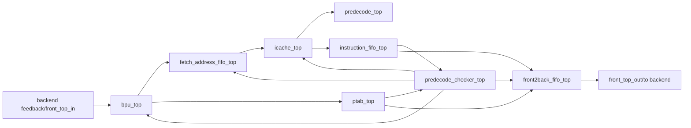

# 前端 Top 连接关系说明

## 1. 交付范围

本文档说明 `top/front_end/` 当前版本的前端顶层连接关系。当前交付内容只表达前端模块之间的输入、输出和顶层对外端口来源，不展开 BPU 表项、ICache RAM、FIFO 存储、寄存器、队列指针和具体组合实现。

当前版本遵循以下规则：

| 规则 | 说明 |
|---|---|
| 顶层端口拆开 | `front_top.v` 不使用总包 `Front_in/Front_out`，而是把 `front_top_in/front_top_out` 中需要对外连接的字段拆成独立端口。 |
| 模块 wrapper 分层 | 总 `front_top.v` 只做一级连线和必要组合胶水；各模块目录下的 `xxx_top.v` 负责本模块 `pi/po` 打包和字段拆分。 |
| BSD 接口统一 | 各 `xxx_bsd_top` 对外接口统一使用 `pi/po`。 |
| 不展开内部状态 | BPU 历史寄存器、预测表、ICache 数组、FIFO 存储和 PTAB 队列不作为模块对外端口。 |
| 不自行新增无依据端口 | 顶层端口来自 `front_IO.h`、`front_top.cpp` 和 `BPU_TOP::OutputPayload` 已有字段；如后续必须新增，需要单独说明来源。 |

## 2. 目录结构

```text
top/front_end/
|-- front_top.v
|-- bpu/
|   |-- bpu_top.v
|   `-- slices/
|-- fetch_address_fifo/
|   |-- fetch_address_fifo_top.v
|   `-- slices/
|-- icache/
|   |-- icache_top.v
|   `-- slices/
|-- instruction_fifo/
|   |-- instruction_fifo_top.v
|   `-- slices/
|-- ptab/
|   |-- ptab_top.v
|   `-- slices/
|-- predecode/
|   |-- predecode_top.v
|   `-- slices/
|-- predecode_checker/
|   |-- predecode_checker_top.v
|   `-- slices/
|-- front2back_fifo/
|   |-- front2back_fifo_top.v
|   `-- slices/
`-- 前端Top连接关系说明.md
```

## 3. 主要依据

参考文件如下：

```text
simulator-new-lsu-tmp/front-end/front_IO.h
simulator-new-lsu-tmp/front-end/front_top.cpp
simulator-new-lsu-tmp/front-end/front_module.h
simulator-new-lsu-tmp/front-end/predecode.h
simulator-new-lsu-tmp/front-end/predecode_checker.h
simulator-new-lsu-tmp/front-end/BPU/BPU.h
```

当前前端保留 8 个一级模块：

| 模块目录 | 对应源码结构/函数 |
|---|---|
| `bpu` | `BPU_in`、`BPU_TOP::OutputPayload`、`bpu_instance.bpu_comb_calc` |
| `fetch_address_fifo` | `fetch_address_FIFO_in/out`、`fetch_address_FIFO_comb_calc` |
| `icache` | `icache_in/out`、`icache_comb_calc` |
| `instruction_fifo` | `instruction_FIFO_in/out`、`instruction_FIFO_comb_calc` |
| `ptab` | `PTAB_in/out`、`PTAB_comb_calc` |
| `predecode` | `predecode_in`、`PredecodeResult` |
| `predecode_checker` | `predecode_checker_in/out` |
| `front2back_fifo` | `front2back_FIFO_in/out`、`front2back_FIFO_comb_calc` |

## 4. 顶层数据流



## 5. 顶层对外端口来源

### 5.1 输入端口

| 顶层输入 | 来源依据 | 当前连接 |
|---|---|---|
| `reset` | `front_top_in.reset` | 进入 BPU、FIFO、PTAB、ICache 等全局控制胶水。 |
| `back2front_valid` | `front_top_in.back2front_valid` | 输入 `bpu_top`，用于提交更新。 |
| `refetch` | `front_top_in.refetch` | 作为后端恢复请求进入 BPU、FIFO 和全局 refetch 胶水。 |
| `itlb_flush` | `front_top_in.itlb_flush` | 输入 `icache_top`。 |
| `fence_i` | `front_top_in.fence_i` | 输入 `icache_top`。 |
| `refetch_address` | `front_top_in.refetch_address` | 后端 refetch 时输入 BPU。 |
| `predict_base_pc/predict_dir/actual_dir/actual_br_type/actual_target` | `front_top_in` 后端提交更新字段 | 输入 `bpu_top`。 |
| `alt_pred/altpcpn/pcpn/tage_idx/tage_tag/sc_*/loop_*` | `front_top_in` TAGE/loop 元数据 | 输入 `bpu_top`，用于预测器更新。 |
| `FIFO_read_enable` | `front_top_in.FIFO_read_enable` | 连接 `front2back_fifo_top.read_enable`。 |
| `csr_status` | `front_top_in.csr_status` | 输入 `icache_top`。 |

### 5.2 输出端口

| 顶层输出 | 来源模块 | 当前连接 |
|---|---|---|
| `FIFO_valid` | `front2back_fifo_top` | 对应 `front2back_FIFO_out.front2back_FIFO_valid`。 |
| `commit_stall` | `bpu_top` | 来自 `BPU_TOP::OutputPayload.update_queue_full`，对应 `front_top.cpp` 中 `out_ptr->commit_stall = bpu_output.update_queue_full`。 |
| `pc` | `front2back_fifo_top` | 来自 `front2back_FIFO_out.predict_base_pc`。 |
| `instructions` | `front2back_fifo_top` | 来自 `front2back_FIFO_out.fetch_group`。 |
| `predict_dir` | `front2back_fifo_top` | 来自 checker 修正后的 `predict_dir_corrected`。 |
| `predict_next_fetch_address` | `front2back_fifo_top` | 来自 checker 修正后的 `predict_next_fetch_address_corrected`。 |
| `page_fault_inst/inst_valid` | `front2back_fifo_top` | 从 ICache 经 instruction FIFO 和 front2back FIFO 输出。 |
| `alt_pred/altpcpn/pcpn/tage_idx/tage_tag/sc_*/loop_*` | `front2back_fifo_top` | BPU 输出经 PTAB 和 front2back FIFO 传递到后端。 |

## 6. 一级模块连线

| 来源模块/外部 | 信号 | 去向模块/外部 |
|---|---|---|
| 后端外部输入 | `back2front_valid/refetch/refetch_address/predict_* /actual_* /metadata` | `bpu_top` |
| `bpu_top` | `icache_read_valid/fetch_address` | `fetch_address_fifo_top` |
| `bpu_top` | `predict_dir/predict_next_fetch_address/predict_base_pc/metadata` | `ptab_top` |
| `bpu_top` | `update_queue_full` | 顶层 `commit_stall` |
| `fetch_address_fifo_top` | `read_valid/fetch_address` | `icache_top` |
| `icache_top` | `fetch_group/fetch_pc/page_fault_inst/inst_valid` | `instruction_fifo_top` 与 `predecode_top` |
| `predecode_top` | `predecode_type/predecode_target_address` | `instruction_fifo_top` |
| `instruction_fifo_top` | 指令、PC、异常、预译码结果 | `predecode_checker_top` 与 `front2back_fifo_top` |
| `ptab_top` | 预测方向、下一取指地址、预测 PC、metadata | `predecode_checker_top` 与 `front2back_fifo_top` |
| `predecode_checker_top` | `predict_dir_corrected/predict_next_fetch_address_corrected` | `front2back_fifo_top` |
| `predecode_checker_top` | `predecode_flush_enable` | 顶层 `global_refetch` 胶水 |
| `front2back_fifo_top` | 前端最终输出包 | 顶层输出到后端 |

## 7. 关键组合胶水说明

### 7.1 global_refetch

`front_top.cpp` 中前端全局恢复来源有两类：

| 来源 | 当前 Verilog 表达 |
|---|---|
| 后端 `refetch` | `refetch` |
| predecode checker 发现预测需修正 | `checker_out_predecode_flush_enable` |

当前 `front_top.v` 中表达为：

```verilog
assign global_refetch = refetch || checker_out_predecode_flush_enable;
assign global_refetch_address =
    refetch ? refetch_address :
    checker_out_predict_next_fetch_address_corrected;
```

### 7.2 BPU stall

`front_top.cpp` 中 BPU stall 由 fetch address FIFO 满或 PTAB 满引起。当前表达为：

```verilog
assign bpu_stall = fetch_address_fifo_out_full || ptab_out_full;
assign bpu_can_run = ~bpu_stall || global_reset || global_refetch;
```

### 7.3 PTAB predict_base_pc

`front_ptab_write_comb` 中每个 lane 的 `predict_base_pc[i]` 由 `bpu_output.out_pred_base_pc + i * 4` 得到。当前 `front_top.v` 用 generate 块生成 `ptab_in_predict_base_pc_group`，没有把 base PC 简单复制到每个 lane。

### 7.4 instruction FIFO seq_next_pc

当前 `instruction_fifo_seq_next_pc` 按主线取指地址加 `FETCH_WIDTH * 4` 得到，用于表达 `front_top.cpp` 中写入 instruction FIFO 时的 `seq_next_pc` 行为。

### 7.5 可选路径说明

源码中存在 `ENABLE_2AHEAD`、`FRONTEND_IDEAL_ICACHE_DUAL_REQ_ACTIVE` 和 bypass 相关路径。当前交付版只画主线连接，不额外新增第二个 FIFO 或第二套 ICache 模块。相关信号保留在 BPU/ICache wrapper 字段中，后续如果老板要求展开 2-ahead 或 dual request，再单独细化。

## 8. 当前未展开内容

| 内容 | 当前处理 |
|---|---|
| BPU 内部 TAGE/BTB/TypePredictor/NLP/queue | 不展开，保留在 `bpu_top.v` 内部 `bsd_top` 后续实现。 |
| ICache 内部 RAM、miss、ITLB/PTW runtime | 不展开，保留在 `icache_top.v` 内部。 |
| FIFO/PTAB 存储、head/tail 指针 | 不作为对外端口，保留在模块内部。 |
| predecode/checker 具体判断逻辑 | 不展开，保留在对应模块内部。 |
| 性能统计和 debug dump | 不进入当前 RTL top。 |

## 9. 格式要求

所有 `.v` 文件不使用以下模板语句：

```verilog
`ifndef ...
`define ...
`endif
`default_nettype none
`default_nettype wire
```

拼接与拆包统一采用一根信号一行的形式，便于逐项核对端口来源。
